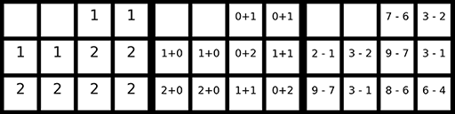

# Pixel-art color-by-number generator

This project allows the creation of a color-by-number worksheet from any image. The idea is taken from [this website](https://www.coloringsquared.com/). The code automatically performs the following steps:

- Crop a square region in the center of the image.

- Resize the image to 24x24.

- Limit the number of colors to a predefined quantity.

- Create a ready-to-print worksheet.

Note, however, that the input image should be already a pixel-art image. Otherwise, the resulting image will lack any well-defined details.

The worksheet can be generated in any of three variants:

- Each cell displays the number of the corresponding color.

- Each cell displays an addition that must be solved to obtain the corresponding color.

- Each cell displays a subtraction that must be solved to obtain the corresponding color.

Kids love it!

You can try it on Google Colab and use your own images: 
